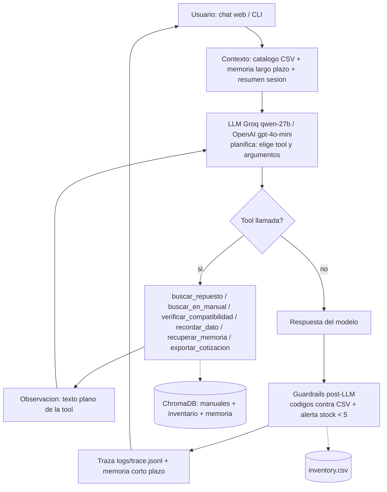
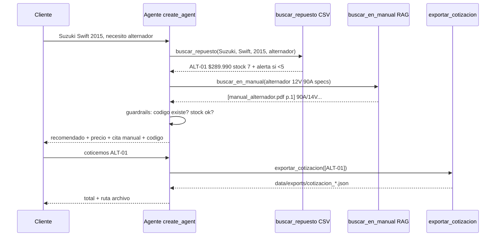
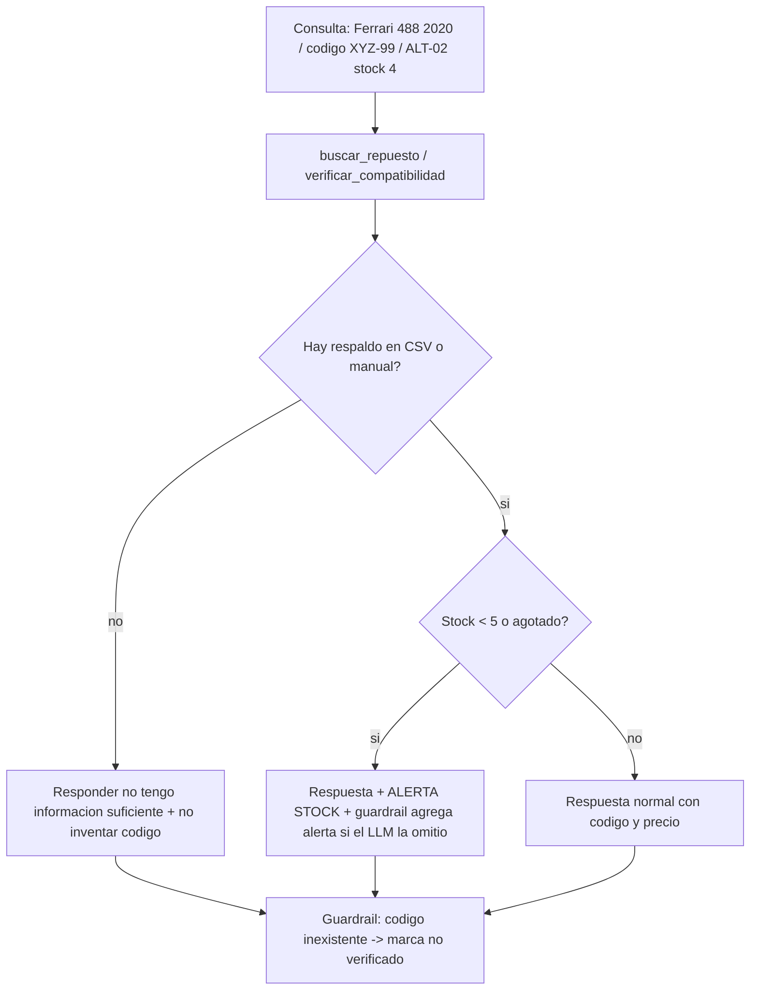
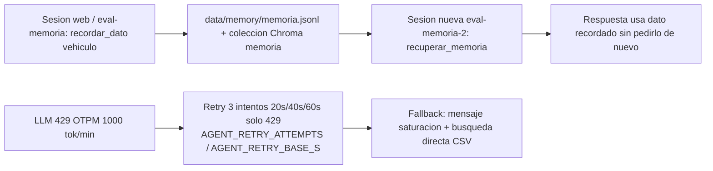

# Diagramas de orquestación y flujos — Repuestos Sur (EP2, IE7/IE9)

> Fuente para el informe de 5 páginas y el README. Renderizan en GitHub
> (bloques `mermaid`). Decisiones asociadas en `agents.md` D6/D9/D10/D12.

## 1. Orquestación general del agente (IE7)

Lectura: el LLM nunca toca CSV ni Chroma directo; solo decide qué tool
llamar (`agent/agent.py`, `agent/tools.py`). Los guardrails (`agent/guardrails.py`)
re-verifican en código, no solo en prompt (D10). Memoria corto plazo: ventana
10 turnos; largo plazo: JSONL + Chroma semántico (D9).

## 2. Flujo: búsqueda y cotización (IE9, caso feliz)

Evidencia real: casos C01/C09/C12 en `tests/resultados/eval_reporte.md`.

## 3. Flujo: negativa sin fuente + alerta stock (IE9, regla no negociable)

Evidencia real: C05/C06 negativa, C07 alerta, C11 guardrail.

## 4. Memoria y límite de tasa (D9/D12)

